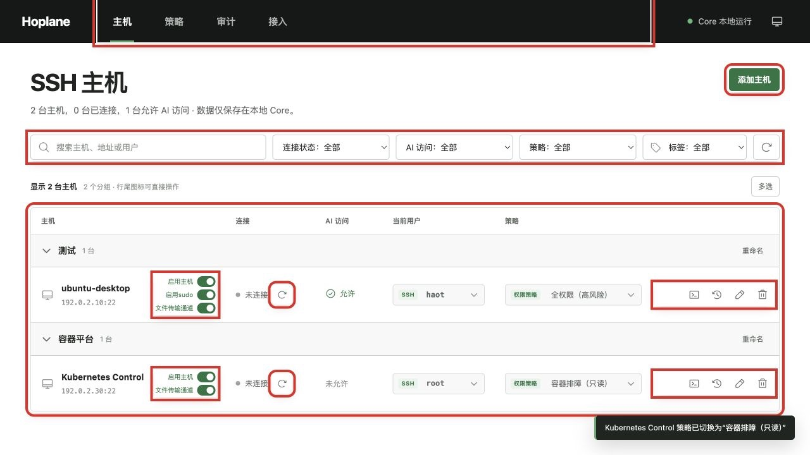
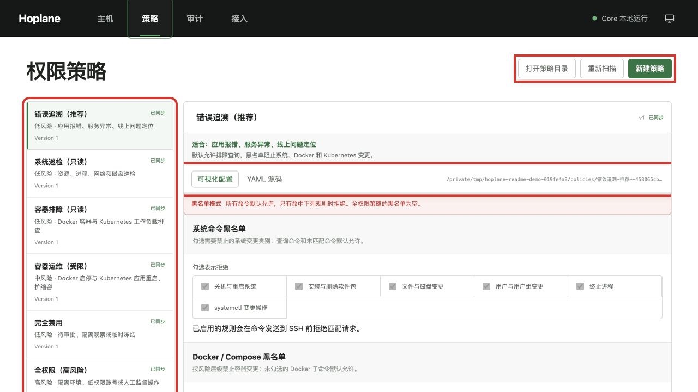
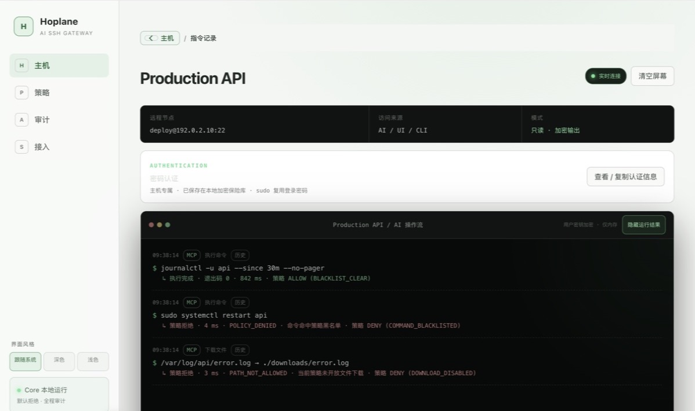
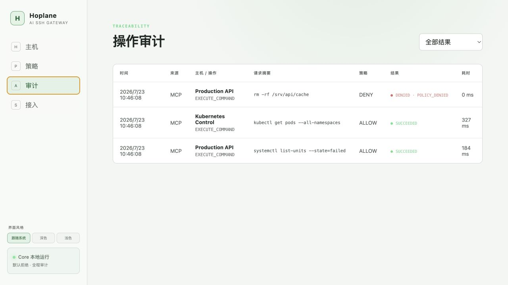
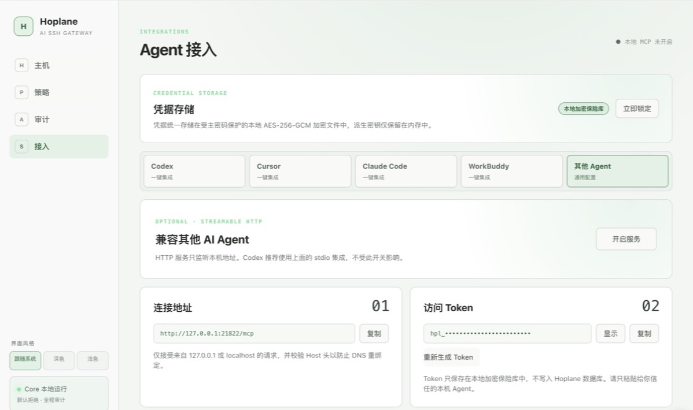

# Hoplane

<p align="center">
  
</p>

<p align="center">
  <strong>让 AI 安全地操作 SSH 主机，同时把凭据、权限与最终控制权留在本地。</strong>
</p>

Hoplane 是一个面向 AI Agent 的本地 SSH 网关与桌面运维工具。它把主机管理、本地加密凭据、Policy V4、操作审计、文件传输、AI 指令记录和人工交互终端放在同一个 App 中，并可一键接入 Codex、Cursor、Claude Code 与 WorkBuddy。

AI 不会获得登录密码、私钥口令或 sudo 密码，也不能自行确认新的 SSH 主机指纹。所有 MCP 命令和文件操作都要经过主机开关、当前登录身份、权限策略与审计链路；需要人工处理时，用户可以在 App 内打开独立的交互式终端。

> 当前版本：`0.1.2`。项目处于 MVP 阶段，安装包尚未进行正式代码签名或公证。

## 为什么使用 Hoplane

| 能力 | 直接让 Agent 使用 SSH | 常见单配置 SSH MCP | Hoplane |
| --- | --- | --- | --- |
| 凭据与 Agent 隔离 | 很难保证 | 取决于实现 | 本地加密保险库，MCP/CLI 不返回凭据 |
| 多主机管理 | 通常没有 | 多依赖配置文件 | 分组、标签、启停、测试与多选复制 |
| 多登录身份 | Agent 自行选择密钥 | 通常单一身份 | 每台主机可保存多套身份，AI 只使用当前身份 |
| sudo 验证 | 可能需要暴露密码 | 常见为 NOPASSWD | Hoplane 在 SSH 通道内应答，密码不返回 Agent |
| 主机级授权 | 依赖密钥权限 | 通常较弱 | 独立 AI 开关、策略和当前登录用户 |
| Docker / Kubernetes 控制 | 无统一边界 | 常靠手写规则 | 内置场景模板与可视化命令黑名单 |
| 文件传输边界 | 通常没有 | 取决于实现 | 路径、大小和覆盖策略 |
| Agent 接入 | 依赖 Agent Shell 权限 | 手动配置 | Skill + stdio MCP 一键安装 |
| 操作追踪 | Shell 历史有限 | 取决于实现 | 策略判断、状态、错误和耗时统一审计 |
| 人工接管 | 需要切换 SSH 工具 | 通常没有 | App 内独立 PTY 终端，不暴露给 AI |
| 紧急停止 | 回收密钥 | 修改配置 | 停用主机或关闭 AI 访问立即生效 |

Hoplane 的核心设计：

- **本地优先**：Core、SQLite、策略 YAML 和加密保险库都保存在本机，不依赖 Hoplane 云服务。
- **AI 最小暴露**：Agent 只看到允许 AI 访问的主机及其能力，不会收到密码、口令、私钥内容或保险库数据。
- **身份可切换**：一台主机可保存多套 SSH 登录身份；当前激活身份是 AI 唯一可用的身份。
- **权限可解释**：使用内置场景模板快速开始，也可通过可视化界面或 YAML 直接维护命令与文件策略。
- **结果可追踪**：允许、拒绝、失败、超时和文件传输都会生成结构化审计记录。
- **人工与 AI 分离**：AI 操作受策略控制；人工交互终端是独立 UI 通道，边界和审计方式明确区分。

## 界面预览

### 主机分组与独立授权

主机支持分组折叠、分组重命名、启用/停用和多选复制。每台主机可以快速切换 AI 当前登录用户、sudo 权限和策略。



### 可视化策略与 YAML 编辑

策略页面提供场景模板、可视化黑名单、文件传输边界和 YAML 源码两种编辑方式。



### AI 指令记录与加密运行结果

按主机实时查看 AI 发出的命令、策略判断和执行状态。运行结果可由用户控制显示，并使用主密码派生密钥在 Core 内存中加密。



### 统一操作审计

成功、拒绝、失败与超时都会记录来源、主机、请求摘要、策略判断、错误码和耗时。



### 多 Agent 一键接入

App 只检查有限的常见配置位置，也支持手动选择目录。Codex、Cursor、Claude Code 和 WorkBuddy 使用稳定的 stdio MCP；其他兼容客户端可选用本机 Streamable HTTP MCP。



> 截图使用独立演示数据和 [RFC 5737](https://datatracker.ietf.org/doc/html/rfc5737) 保留地址，不包含真实服务器信息。

## 两条操作通道

Hoplane 明确区分 AI 自动操作与用户人工终端：

| 通道 | 登录身份 | Policy V4 | 审计范围 | 凭据 |
| --- | --- | --- | --- | --- |
| MCP / CLI 命令与文件操作 | 主机当前激活身份 | 必须通过 | 请求、策略、状态、耗时、错误等 | 由 Hoplane 解析，不返回调用方 |
| App 人工交互终端 | 用户在终端页选择的身份 | 不经过 AI 黑名单 | 会话开始、结束、耗时、退出码或错误 | 由 Hoplane 解析，不显示在终端配置中 |

人工终端使用独立 PTY 和 WebSocket 连接，可运行交互式 Shell 应用。终端输入与输出不写入数据库，也不进入 AI 指令记录；切换终端身份不会改变 AI 当前身份。终端会话不会跨 App/Core 重启恢复。

## 工作方式

```text
Codex / Cursor / Claude Code / WorkBuddy / Other Agents
                         │
                   stdio / HTTP MCP
                         │
                         ▼
┌──────────────────────────────────────────────────┐
│                   Hoplane Core                   │
│                                                  │
│  Host Registry ── Policy V4 ── Operation Service │
│       │               │               │          │
│  Encrypted Vault      └────── Audit + Monitor    │
└───────────────────────────────┬──────────────────┘
                                │ SSH / SFTP
                                ▼
                         Remote Hosts

Desktop App ── same-origin WebSocket ── Human PTY Session
```

一次 AI 远程操作会依次经过：

```text
Agent 提交 host_id 与操作
→ 检查主机是否存在、启用并允许 AI 访问
→ 加载当前激活登录身份
→ 检查 sudo 开关和主机绑定策略
→ 检查命令黑名单或文件传输边界
→ 从本地保险库解析受管密码/口令
→ 执行 SSH / SFTP
→ 脱敏并写入审计
→ 返回结构化结果
```

## 功能

### 主机、分组与多登录身份

- 新增、编辑、删除、启用/停用并测试 SSH 主机；
- 支持密码、私钥文件/口令和 SSH Agent；
- 每台主机分别配置地址、端口、默认目录、标签、策略、AI 访问开关和默认关闭的主机间文件传输开关；
- 主机可按自定义分组折叠展示，可选择已有分组、创建新分组或重命名整组；
- 多选模式支持全选、按组选择，并复制所选主机的显示名称与地址；
- 一台主机可保存多套登录身份，每套身份独立绑定认证方式和 sudo 权限；
- AI 始终只使用当前激活身份；切换身份会断开旧连接，后续操作使用新用户；
- 备用身份可在人工终端中单独选择，不改变 AI 当前身份；
- 新增主机后自动发起连接测试；
- Core API 支持导入基础 SSH Config 主机条目，导入后默认不开放 AI 访问；
- 最多保留 20 个池化 SSH 命令连接。

主机状态是当前 Core 进程内的连接状态，不是持续健康检查：

- `CONNECTED`：当前存在已就绪的池化 SSH 连接；
- `CONNECTING`：正在建立连接；
- `DISCONNECTED`：当前没有活动连接，不等于主机故障；
- `AUTH_FAILED` / `FAILED` / `HOST_KEY_BLOCKED`：最近连接在对应阶段失败或被安全检查阻止。

### SSH 指纹与连接保护

- 首次连接采用需要人工确认的 TOFU 流程；
- Hoplane 先记录服务器 SHA-256 指纹并阻止连接，用户在 App 确认后才会信任；
- 已信任指纹发生变化时继续阻止连接并显示明确警告；
- MCP、CLI 和 Agent 都不能代替用户接受主机指纹；
- App 区分认证失败、网络不可达、连接被拒绝、超时、DNS 失败和一般 SSH 错误；
- 主机连接配置或当前身份变化时会断开旧连接，避免复用过期会话。

### 本地加密保险库

- 使用 scrypt 从主密码派生 256 位密钥；
- 使用 AES-256-GCM 对本地保险库进行认证加密；
- 每次保存使用新的随机 IV，主密钥只保留在进程内存中；
- 默认保存到 `~/.hoplane/vault.enc`，不依赖系统钥匙串；
- 登录密码、私钥口令、独立 sudo 密码和 HTTP MCP Token 以随机引用存储；
- 私钥文件本体保留在用户配置的本地路径中，保险库保存其口令而不是复制私钥文件；
- 锁定保险库会清除内存密钥、关闭 SSH 连接并清除实时输出；
- 用户重新验证主密码后，可在 30 秒内查看和复制当前身份的密码、私钥口令或私钥文件内容；
- 凭据查看仅允许同源 App 页面调用，成功与失败都会进入审计；
- MCP 和 CLI 无权调用凭据查看接口。

保险库目录权限为 `0700`，保险库文件权限为 `0600`。主密码不可恢复且当前不支持修改，请妥善保存。

### sudo 代验证

非 root 身份可以独立启用 sudo，并选择：

- 仅允许远端已配置的 `NOPASSWD`；
- 复用 SSH 登录密码；
- 使用独立 sudo 密码。

当使用受管密码时，Hoplane 会把检测到的 sudo 调用改写为带随机提示标记的非交互形式，并只在远端提示实际出现后通过 SSH 标准输入应答。链式命令中的多个 sudo 提示会分别处理；提示标记会从 stderr 过滤。

密码不会写入命令、环境变量、审计或 MCP 返回内容。未配置受管密码时使用 `sudo -n`，避免等待输入。身份关闭 sudo 时，请求会在执行前拒绝；即使身份允许 sudo，命令仍必须通过当前策略。

### Policy V4

Policy V4 采用命令黑名单模型；主机是否允许参与文件中继不属于策略，而由每台主机自己的默认关闭开关控制：

- `commandBlacklist` 中的 Unicode 正则按顺序匹配原始命令；
- 命中任意规则即拒绝；
- 未命中规则默认允许；
- “全权限”模板的命令黑名单为空；
- 策略继续控制文件上传、下载、覆盖、大小和允许路径；中继还必须同时开启源、目标主机的传输开关，并分别通过源端下载与目标端上传约束。

内置模板：

| 模板 | 风险 | 行为 |
| --- | --- | --- |
| 错误追溯（推荐） | 低 | 允许未命中的排障查询，阻止已收录的系统、Docker、Kubernetes 变更和 Shell 包装/组合 |
| 系统巡检（只读） | 低 | 允许系统查询，阻止常见系统变更以及所有 `docker`、`kubectl` 命令 |
| 容器排障（只读） | 低 | 允许未命中的 Docker/Kubernetes 查询，阻止已收录的状态变更与高风险操作 |
| 容器运维（受限） | 中 | 放开常规启停、重启和扩缩容，继续阻止已收录的远程执行、删除、构建和资源写入 |
| 完全禁用 | 低 | 拒绝所有命令并关闭文件传输 |
| 全权限（高风险） | 高 | 命令黑名单为空，允许任意路径的上传、下载和覆盖，单文件上限 10 GiB |

除“全权限”外，内置模板默认关闭文件传输。自定义策略启用传输后，默认单文件上限为 100 MiB。

Docker、Compose 与 Kubernetes 仍通过通用 `execute_command` 执行，不是独立容器 API。Hoplane 使用命令正则识别常见操作，包括：

- Docker 启停、重启、`exec`、`run`、删除、构建、清理和部分 Compose 写操作；
- Kubernetes 重启、扩缩容、`set`、`exec`、`apply`、`patch`、`delete`、`port-forward` 和部分节点维护操作；
- Shell 组合符、重定向、命令替换、sudo/env/Shell 包装。

> 黑名单是正则匹配，不是 Shell AST、Docker 授权插件或 Kubernetes RBAC。未收录的命令形式默认允许，规则也可能产生误判。生产环境仍应为 AI 使用独立低权限账号，并结合系统权限、容器权限与集群 RBAC。

### YAML 策略同步

每个策略对应一个本地 YAML 文件：

```text
~/.hoplane/policies/<slug>--<uuid>.yaml
```

- App 的可视化编辑器与 YAML 编辑器共享同一份草稿；
- Core 监听策略目录顶层的 `.yaml` 与 `.yml` 文件；
- 合法新增文件会自动导入，没有 `id` 时生成 UUID 并回写；
- 合法修改会更新 SQLite 运行快照并增加版本；
- 未知字段、错误类型、非 V3 Schema 和无效正则不会生效；
- 已有策略的 YAML 无效时保留上一份有效运行快照，并显示错误位置；
- 文件缺失时策略标记为 `MISSING`，绑定主机的后续操作统一拒绝；
- 可从上一份有效快照恢复缺失文件；
- 保存使用 `expectedVersion` 乐观锁，避免覆盖外部修改；
- Hoplane 保存 YAML 时使用临时文件加原子重命名，目录/文件权限分别为 `0700` / `0600`。

### 命令与文件操作

- 非交互式远程命令最大 32,768 字符；
- 超时范围 100 毫秒至 300 秒，默认 30 秒；
- stdout 与 stderr 默认各限制为 1 MiB，达到上限后标记截断；
- SFTP 上传与下载单个文件；
- 上传源必须是现有普通文件；
- 本地路径经过 `realpath` 后检查允许根目录；
- 远端路径必须是绝对 POSIX 路径；
- 下载会复核远端最终路径，上传会复核目标父目录；
- 下载先写入权限为 `0600` 的临时文件，再原子移动；
- 覆盖权限与单文件大小由策略独立控制；
- 超时会主动关闭对应 SSH channel。

### 指令记录、实时输出与审计

- 每台主机提供只读“指令记录”页面；
- 持久审计记录命令、文件传输、连接测试、凭据查看和人工终端会话；
- 记录来源、客户端 ID、主机快照、请求摘要、策略及版本、判断结果、原因码、状态、退出码、耗时、传输字节数和错误；
- 拒绝、失败、超时和 Core 中断同样进入审计；
- 命令和文件路径摘要会对常见敏感模式进行自动脱敏并限制长度；
- stdout/stderr 不写入 SQLite；
- 按主机开启输出显示后，脱敏后的实时输出通过 SSE 展示；
- 实时输出使用保险库密钥进行 AES-256-GCM 加密，仅在 Core 内存中保留每台主机最近 500 个事件；
- 关闭输出、锁定保险库或退出 Core 后，实时输出无法恢复；
- 人工终端只审计会话边界，不保存用户输入和终端输出。

实时命令结果仍会返回给发起操作的 MCP/CLI 调用方。“不持久化 stdout/stderr”不表示 Agent 看不到执行结果。自动脱敏基于有限规则，用户不应主动把任意秘密写入命令行。

## Agent 集成

### 一键 stdio 集成

| Agent | 默认 Skill 位置 | 默认 MCP 配置 |
| --- | --- | --- |
| Codex | `~/.codex/skills/hoplane` | `~/.codex/config.toml` |
| Cursor | `~/.cursor/skills/hoplane` | `~/.cursor/mcp.json` |
| Claude Code | `~/.claude/skills/hoplane` | `~/.claude.json` |
| WorkBuddy | `~/.workbuddy/skills/hoplane` | `~/.workbuddy/mcp.json` |

App 会：

1. 只检查有限的常见配置位置，不递归扫描整个用户目录；
2. 验证目录、配置文件结构和可写性；
3. 在存在多个有效目录时让用户选择，也支持手动填写绝对路径；
4. 安装 Hoplane Skill；
5. 保留其他配置，只新增或刷新 `hoplane` MCP；
6. 首次修改非空配置时创建一次 `.hoplane-backup`；
7. 写入使用当前 Hoplane App 内置运行时的 stdio 启动入口。

stdio 集成不依赖系统 Node、HTTP MCP 开关或 HTTP Bearer Token。安装完成后必须完全退出并重新打开对应 Agent。配置保存的是 Hoplane App 和适配器的绝对路径，因此应先把 App 放到固定位置；移动或重装 App 后，需要回到“接入”页刷新路径。

Codex 页面还可以直接运行 stdio 初始化和工具列表诊断。其他一键集成会在 Skill 中安装 `scripts/diagnose` 与 `scripts/diagnose.cmd`。

### Streamable HTTP

其他支持 Streamable HTTP MCP 的客户端可以使用：

```text
http://127.0.0.1:21722/mcp
```

HTTP MCP 默认关闭，只监听本机地址，并要求保险库中的独立 Bearer Token。App 会生成可复制的配置，但不同 Agent 的字段格式可能不同，应以目标客户端文档为准。HTTP 开关与 stdio 一键集成互不影响。

### MCP 工具

```text
list_hosts
test_host
execute_command
upload_file
download_file
transfer_file
```

`list_hosts` 只返回同时满足 `enabled=true` 与 `aiAccessEnabled=true` 的主机。所有操作使用 `host_id` 指定目标主机；Agent 不会获得 SSH 凭据。

`transfer_file` 使用两条独立 SSH 连接，将普通文件按流从源主机经 Hoplane 内存传到目标主机。Core 优先使用 SFTP；只有服务器明确无法启动 SFTP 子系统时，才回退到由 Hoplane 固定生成的 POSIX SSH Exec 流。普通路径、权限、覆盖或连接错误不会触发降级。两台主机不需要互相可达，文件不落本机磁盘，也不会返回给 Agent；源、目标主机必须分别开启主机级文件传输开关，策略再负责下载/上传路径、大小和覆盖约束。成功结果的 `transport` 为 `SFTP` 或 `SSH_STREAM`；两种方式都不可用时返回 `FILE_TRANSFER_TRANSPORT_UNAVAILABLE`。

SSH 流回退要求远端允许非交互 Exec，并提供 POSIX Shell、`realpath`、`cat`、`wc`、`mv`、`rm`，禁止覆盖时还需要 `ln`。这些都是一次性命令，不需要安装 Hoplane 服务或启动常驻进程。

## 快速开始

### 使用安装包

构建产物位于 `release/`。发布到 [GitHub Releases](https://github.com/HaotMan/Hoplane/releases) 时，可提供：

```text
Hoplane-<version>-macos-arm64-installer.dmg
Hoplane-<version>-arm64-mac.zip
Hoplane-<version>-windows-x64-installer.exe
Hoplane-<version>-windows-x64.zip
```

macOS：从 DMG 将 App 移到 `/Applications` 等固定目录，或将 ZIP 解压到固定目录后运行。

Windows：运行可选择安装目录的 NSIS Installer，或将 ZIP 解压到固定目录后运行 `Hoplane.exe`。

当前产物未进行正式签名或公证，首次打开可能出现未知开发者/未知发布者提示。项目当前没有 Linux 安装包。

首次配置：

1. 启动 Hoplane，创建至少 10 个字符的本地保险库主密码；
2. 添加主机和第一套登录身份；
3. 等待自动连接测试，并人工核对首次出现的 SSH 主机指纹；
4. 选择权限策略，再开启“允许 AI 访问”；
5. 如有需要，添加备用登录身份并配置 sudo；
6. 在“接入”页选择 Agent 与配置目录，点击一键安装；
7. 完全退出并重新打开 Agent，使 Skill 与 MCP 配置生效。

然后可以直接对 Agent 说：

```text
用 Hoplane 检查 Production API 上失败的 systemd 服务。
用 Hoplane 查看 Kubernetes Control 的 Pod 状态。
用 Hoplane 下载应用日志到本地指定目录。
```

## CLI

完成 `pnpm build` 后：

```bash
pnpm cli -- core status
pnpm cli -- host list
pnpm cli -- host test <host-id>
pnpm cli -- exec <host-id> --directory /opt/app --timeout 30000 -- df -h
pnpm cli -- upload <host-id> ./app.tar /opt/app/app.tar
pnpm cli -- download <host-id> /var/log/app.log ./app.log
pnpm cli -- transfer <source-host-id> /opt/app/release.tar <destination-host-id> /opt/app/release.tar
```

CLI 会按需启动构建后的 Core。命令与文件操作仍经过主机状态、策略、凭据和审计链路。

## 从源码开发

建议环境：

- Node.js 24 或更高版本；
- pnpm `11.15.0`；
- 用于真实连接测试的 SSH 服务器。

安装与开发：

```bash
pnpm install
pnpm dev
```

也可以分别启动：

```bash
pnpm dev:core
pnpm dev:desktop
```

构建与运行：

```bash
pnpm build
pnpm app
```

`pnpm app` 运行已经构建的源码产物。Agent 一键集成依赖安装包中的 Skill 资源，完整测试一键安装时应使用打包后的 App。

构建 macOS DMG 与 ZIP：

```bash
pnpm build:app
```

构建 Windows x64 NSIS Installer 与 ZIP：

```bash
pnpm build:app:win
```

App 会启动内置 Core 并驻留托盘。关闭窗口只会隐藏界面，Core 与 MCP 仍继续运行；需要从托盘菜单选择“退出”才能结束进程。托盘菜单也支持设置登录时启动。

## 数据目录

默认数据位于 `~/.hoplane`：

```text
hoplane.sqlite3  主机、登录身份、策略运行快照和审计
core.token       本地 Core API 随机 Token（0600）
core.pid         Core 进程 ID
core.log         Core 日志
vault.enc        本地加密保险库（0600）
policies/        可直接编辑的 Policy V4 YAML
```

可用于测试实例的环境变量：

```text
HOPLANE_DATA_DIR
HOPLANE_CORE_PORT
HOPLANE_OUTPUT_LIMIT_BYTES
```

Core 与管理界面默认只监听 `127.0.0.1:21722`。

## 安全边界

- Core API、管理界面与 HTTP MCP 只监听本机回环地址；
- HTTP MCP 默认关闭，并使用保险库中的独立随机 Token；
- HTTP MCP 校验 `127.0.0.1` / `localhost` Host 头；
- 新的或变化的 SSH 指纹只能由 App 用户确认；
- MCP 和 CLI 不能查看凭据或修改信任指纹；
- 受管 sudo 密码只在随机远端提示出现后通过 SSH stdin 应答；
- 审计摘要和实时输出会对常见敏感模式进行脱敏并限制长度；
- 管理界面与 Core 同源，Electron 不向网页开放任意系统命令能力；
- 人工交互终端不经过 AI Policy V4，只提供会话级审计；
- 黑名单不能代替远端系统权限、容器权限或 Kubernetes RBAC。

## 验证

```bash
pnpm typecheck
pnpm test
pnpm build
```

自动化测试覆盖：

- Policy V4 命令黑名单、主机级双端文件中继开关、文件路径边界、YAML 同步与版本冲突；
- 数据库迁移、多登录身份、分组重命名和主机状态；
- 本地保险库、凭据查看保护与审计脱敏；
- sudo 命令识别、链式多 sudo 应答和端到端 SSH 行为；
- SSH Config 解析、主机指纹与连接错误分类；
- Agent 配置目录扫描、一键集成与 stdio 工具诊断；
- MCP HTTP 鉴权、操作监控和实时输出。

## 当前限制

- Policy V4 的命令控制仍是正则黑名单，不是完整 Shell 语法分析器；未收录形式默认允许，也可能误判；
- 人工终端会话不持久化，断开或重启后不能恢复；
- 主机间中继当前只支持单个普通文件，不支持目录递归、元数据保留或断点续传；异常退出可能在目标目录留下 `.hoplane-part-*` 临时文件；SSH 流回退当前只支持 POSIX 主机，不支持 Windows PowerShell；
- 暂不支持 MFA、SOCKS、ProxyJump、堡垒机链路和团队同步；
- SSH Config 导入不支持复杂的 `Include`、`Match`、`ProxyJump` 与通配继承；
- HTTP MCP 当前使用单个本机 Agent Token，不支持按客户端独立过期和吊销；
- 本地主密码不可恢复且暂不支持修改；
- 审计记录暂时没有可配置的自动保留期或清理界面；
- 当前只提供 macOS 与 Windows 构建目标，没有 Linux 安装包；
- 安装包尚未正式签名或公证；
- Node.js `node:sqlite` 在部分版本中可能输出实验性 API 提示。

## 项目结构

```text
apps/
  desktop/            React + Electron 桌面 App、人工终端
  cli/                aiterm CLI
packages/
  core/               本地 API、保险库、审计、Agent 集成、终端网关
  ssh-core/           SSH/SFTP、连接池、主机指纹、sudo 处理
  policy/             Policy V4 命令与文件判断
  mcp-adapter/        stdio MCP 适配器与工具
  audit/              脱敏
  shared/             类型、Schema 与内置策略模板
integrations/
  codex/hoplane/      App 内置的 Hoplane Skill
docs/                 MVP 需求、设计和实现说明
test/                 单元、集成与 SSH 端到端测试
```

## 进一步了解

- [MVP 需求文档](docs/AI远程终端管理器-MVP需求文档.md)
- [MVP 设计文档](docs/AI远程终端管理器-MVP设计文档.md)
- [实现说明与后续计划](docs/MVP实现说明.md)

这些文档记录了项目演进过程；当前功能与安全边界以本 README 和现有代码为准。

## 许可证

除下述品牌素材外，本仓库中的源代码和文档采用 [Mozilla Public License 2.0](LICENSE) 授权。

`Hoplane` 名称及以下品牌素材不属于 MPL-2.0 授权范围，相关权利保留：

- `logo.png`
- `build/icon.png`
- `build/icon-win.png`
- `apps/desktop/electron/tray.png`
- `apps/desktop/electron/tray@2x.png`

MPL-2.0 不授予 Hoplane 名称、商标、服务标志或 Logo 的使用权。
